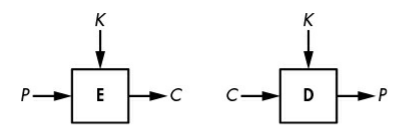

# Notes on Chapter 1: Encryption

Encryption ensure data's *confidentiality*. It uses an algorithm called a *cipher* and a secret value called a *key*. 

In *symmetric encryption*, the key used to decrypt is the same as the key used to encrypt. 

*plaintext*: unencrypted message.

*ciphertext*: encrypted message.

A cipher, **E**, takes a plaintext **P** and a key **K** as input, producing a ciphertext **C** as output.

> Ciphertexts can never be shorter than plaintexts.

The **Caesar Cipher** encrypts a message by shifting each of the letters down three positions in the alphabet, wrapping back around to A if the shift reaches Z. 

This cipher is very easy to break. 

The **Vigenere Cipher**, created in the 16th century, is very similar to the Caesar cipher, except that letters aren't shifted by three places but rather by values defined by a *key*, a collection of letters that represent numbers based on their position in the alphabet. For example, if the key is DUH, letters in the plaintext are shifted using the values 3, 20, 7 because D is three letters after A, U is 20, and H is 7.

This cipher can be broken using a method called *frequency analysis.*